# IoTPlay Sprinkler System


## Introduction

A 4 x leg sprinkler system, and borehole pump switching system with RPi &amp; Node-RED, and ESP8266

## Specifications of the System

Find below the requirements I had when building the flows.

#### Functional:
- 4 sprinkler leg valves to be switched on- and off.
- A borehole pump to be switched on before any leg is activated, and switched off afterwards.  

#### Schedules:
- On the sprinkler `leg schedules`:
  - Able to switch each leg on `twice a day`;
  - Able to choose which legs should sprinkle on `which days`;
  - `Duration between` legs on as a variable- to allow the borehole water to fill-up;  


- All schedules functions to be `data-driven`, where a json file on the system stores the definitions of all above, to allow this file to be manipulated to change sprinkling time, rest period, sprinkle period, and days,- per leg.

#### Web front-end:
A Web front-end to work on a phone, where the sprinkler system can be:  
- **Actions**:
  - put into `auto-mode`, where the data-file is used for the schedule;
  - put in `non-auto mode` or manual, where the schedule does not determine the on/off times;
  - Able to switch any leg `on/off manually`, including the pump;
  - Button to override `All Off` - switching the pump and legs off at once.
- **Reports**:
  - A report to determine the `total sprinkler time per day`;
  - Report on how much `water was pumped` for the day;
  - Report to view the current schedules, times, and rest periods that are set.

## Implementation

### Systems Components Used

Building blocks are:
- [Node-RED](https://nodered.org) on a Raspberry Pi
- [Mosquitto](https://mosquitto.org) as MQTT server running on the same RPi
- The solonoids is controlled with an ESP8266, on a wifi network, using `mqtt` from Node-Red.
- We use ESPEasy on the Node-RED, from the community  [letscontrolit.com](https://www.letscontrolit.com/wiki/index.php/ESPEasy).  
- A MariaDB instance to track stats of sprinkling.


All servers running on the RPi, runs in Docker images & containers, all published on [github IoTPlay](http://github/iotplay).


### Notes on Solution Components

#### The json flatfile with the leg definintions

Example json file on `~/data/sprinklerlegs.cnf` directory that defined the sprinkling times:

```
{"legday":
  [
    [1,1,1,1,1,0,1,"L1A",15,40],
    [0,0,0,0,0,1,0,"L1B",15,40],
    [1,1,1,1,1,0,1,"L2A",15,40],
    [0,0,0,0,0,0,0,"L2B",15,40],
    [0,0,0,0,0,0,0,"L3A",15,40],
    [1,1,1,1,1,1,1,"L3B",15,40],
    [0,0,0,0,0,0,0,"L4A",15,40],
    [1,1,1,1,1,1,1,"L4B",15,40]
  ]
}
```

Row 1 explained: sprinkle leg 1, morning, for 15 minutes, then rest 40 minutes for the borehole to fill-up, and sprinkle all days except Friday (our grass is cut on this day).

#### The configuration of the ESPEasy config
Some of the configs:

##### ESP configs

- See screens 4-6 below, for the Devices.
- Also see the Rules, which mqtt messages trigger in the file [ESP8266_rules](ESP8266_rules.txt).

##### Node-RED config  
The most complex part of the auto-switching - per rules from the json file, are in the NR section below:

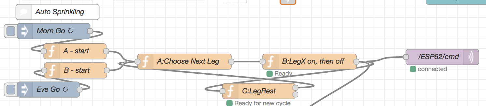

Import the json file [NR_autoswitching.json](NR_autoswitching.json) into Node-RED to get these flows into Node-RED.  


#### Electronics & Solenoids

The `sprinkler controller` is housed in 2 enclosures, see pictures 1 to 6 below. The 2 housings are:
- Housing A) `ESP8266 controller` - with an 8-way plug with all control signals to -
- Housing B) `Solenoids` for the sprinkler legs, and the pump.

##### Controller A: ESP8266 Controller

It has 3 plugs at the bottom, see picture 1, right enclosure:
- 4-way round steel plug: For the 1" water [flow meter](https://www.ebay.com/itm/G1-1-60L-min-Water-Flow-Sensor-Switch-Hall-Effect-Sensor-Flow-Meter-Sensor/171797057803?hash=item27ffe7110b:g:4WoAAOSw3xJVXXwZ) from the borehole pump.
- 8-way round steel plug: Control cable `to Controller B` - using CAT-5 cable
- 3-way audio plug: To an `DHT22` temp & humidity sensor.
- 220v in (on top side) see picture 2.


###### Controller B: The Solenoids

See picture 1 - left enclosure.
- 8-way steel round plug: From controller A via CAT-5.
- 220v in.
- 8-way green plastic plug: Relays, from left:
  - Pin 1: Relay 1 - leg 1, (to gpio15 on controller A)
  - Pin 2: Relay 2 - leg 2, (to gpio00 on controller A)
  - Pin 3: Relay 3 - leg 3, (to gpio05 on controller A)
  - Pin 4: Relay 4 - leg 4, (to gpio04 on controller A)
  - Pin 5: Relay 5 - pump,  (to gpio02 on controller A)
  - Pin 7: Ground
  - Pin 8: VCC 5v


## Todo
The project is not yet completed. Further requirements includes:
- Did it, or is it raining? Is it, or will the rain be enough? Use either barometric pressure, and/or [Darksky](https://flows.nodered.org/node/node-red-node-darksky) forecast, and the IoTPlay ESP8266 rain meter to stop sprinkling for a day;  

- Amount of water to drop based on levels of Soil moisture, using for instance [Tindie's SoilWatch10](https://www.tindie.com/products/pinotech/soilwatch-10-soil-moisture-sensor/?pt=ac_prod_search).

- Change starting time of the cycle with the season's changes.


## The Screens of Dashboard, Node-RED, and Photos of the Electronics  

### The Node-RED Dashboard  
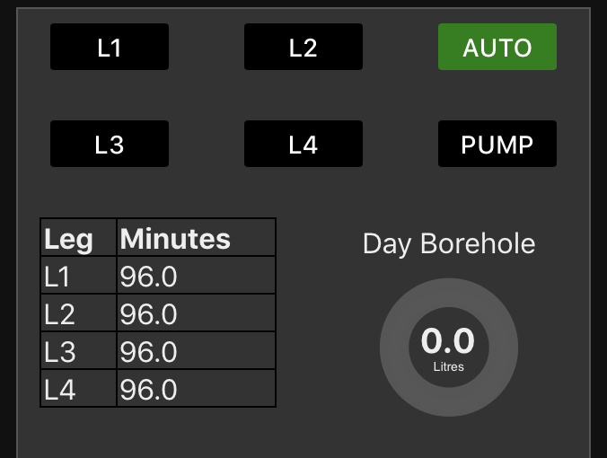  
  Screen 1: Node-RED dashboard screen 1  

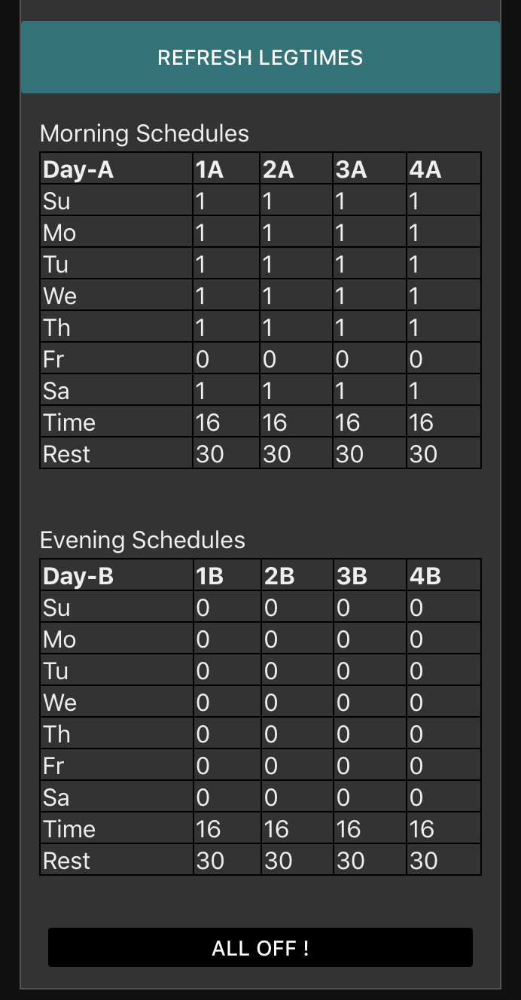  
Screen 2: Node-RED dashboard screen 2  


### The Node-RED Admin screen  
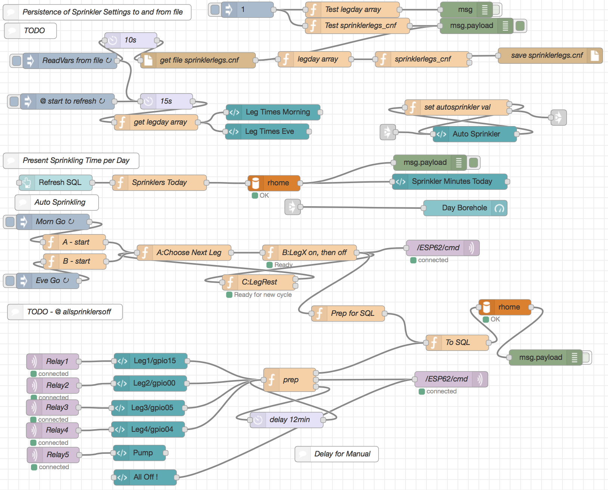  
Screen 3: Node-RED Admin flows  

### The ESP8266 Config Screens  

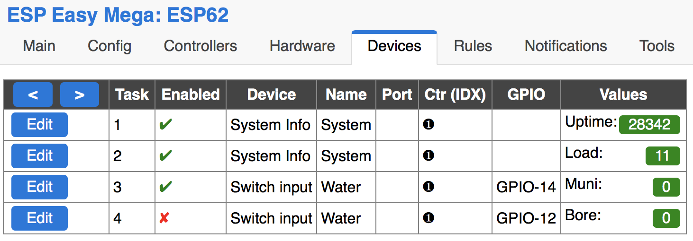  
Screen 4: ESPEasy config screeen 1  

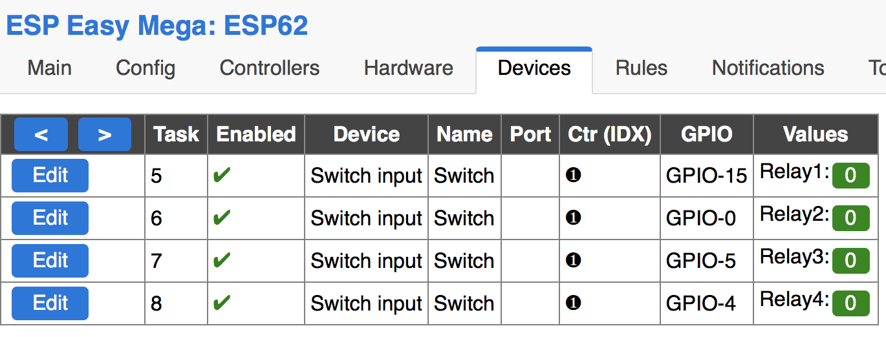  
Screen 5: ESPEasy config screeen 2  

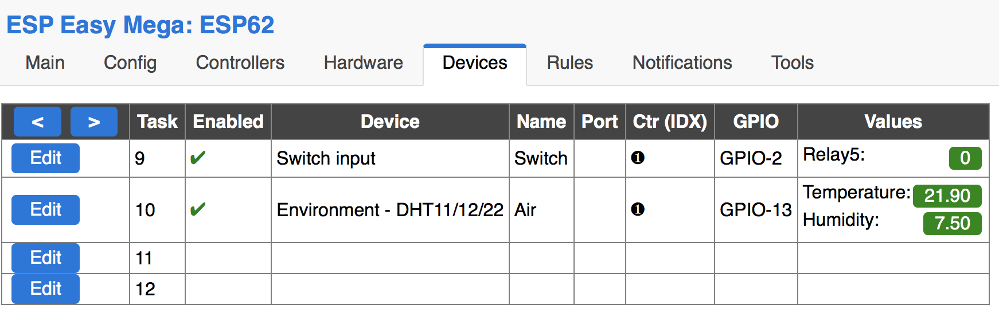  
Screen 6: ESPEasy config screeen 3  

### The Sprinkler Controller  

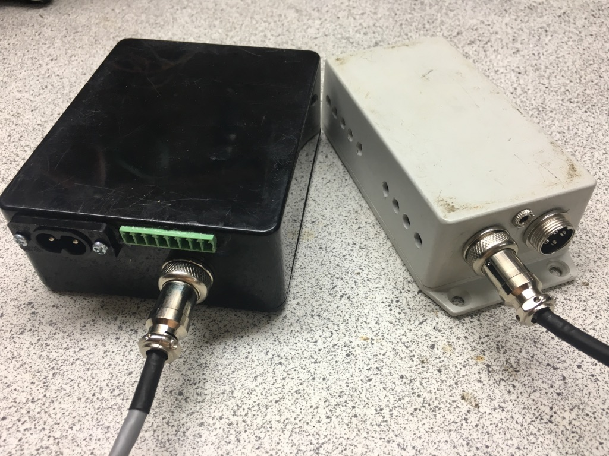  
Picture 1: Left - The (controller B) Solenoids, Right - (controller A) the ESP controller  

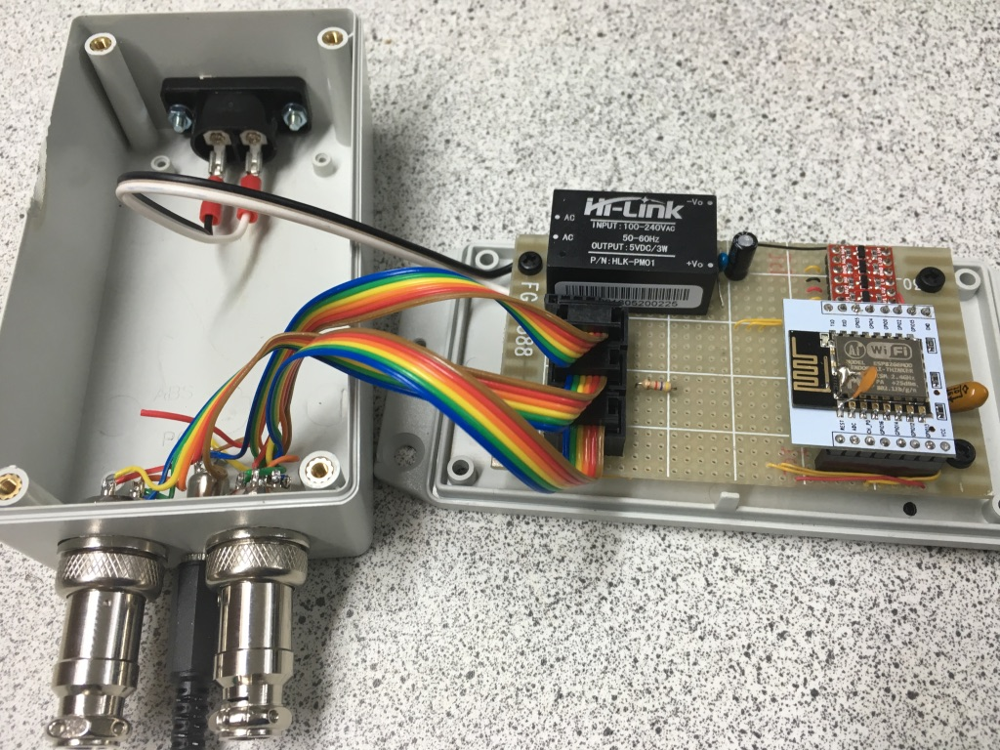  
Picture 2: ESP controller Inside  

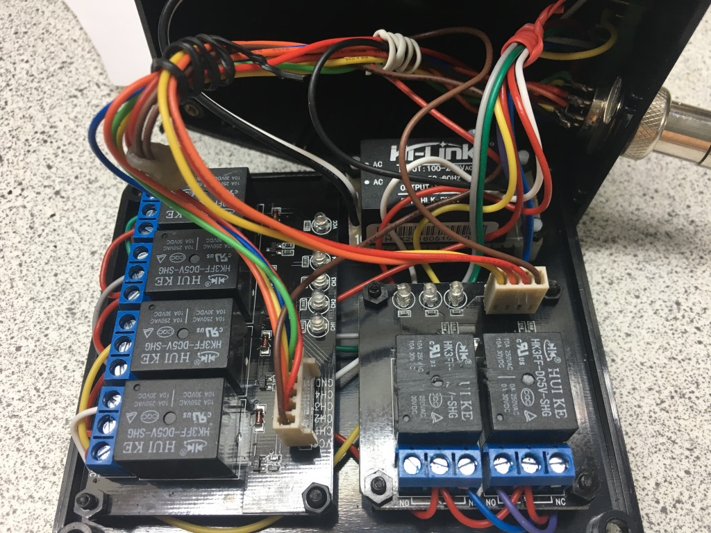  
Picture 3: Solonoid controller Inside view 1  

  
Picture 4: Solonoid controller Inside view 1  

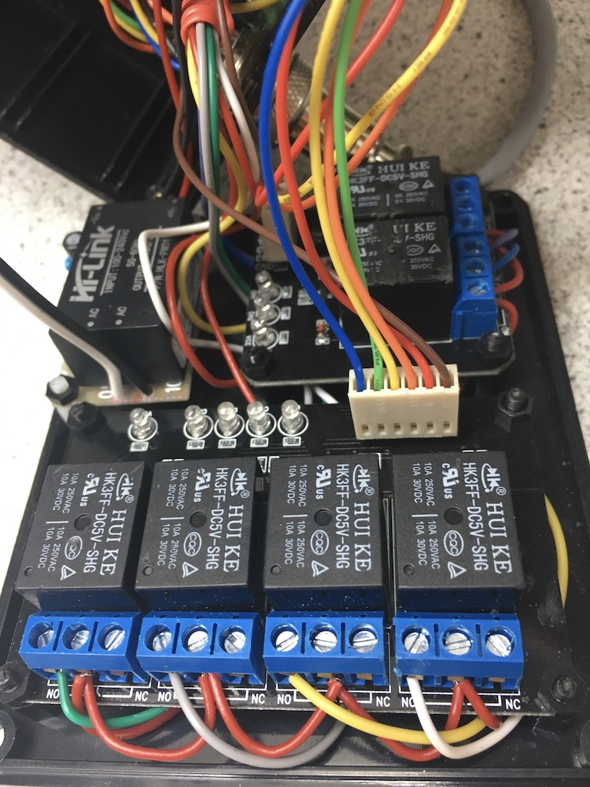  
Picture 5: Solonoid controller Inside view 2  

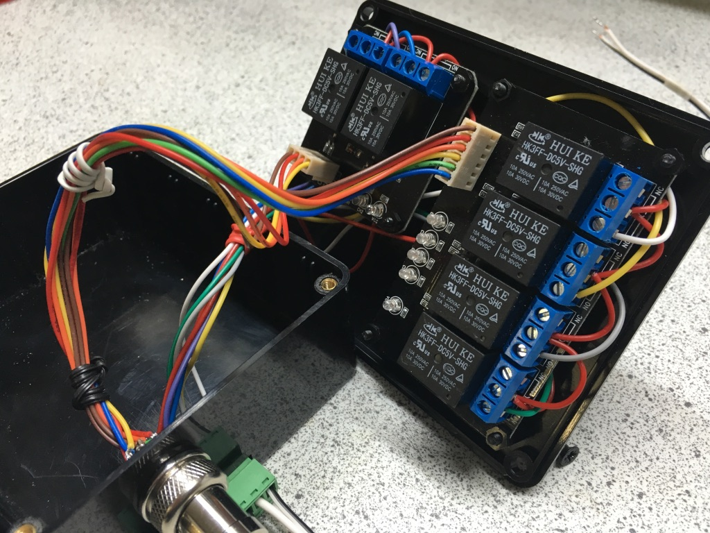  
Picture 6: Solonoid controller Inside view 3  
